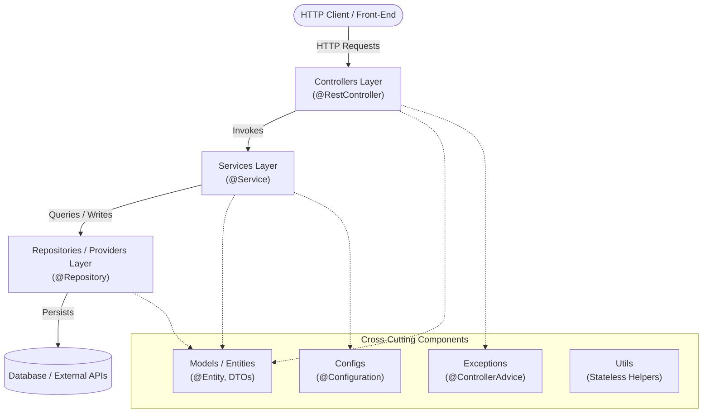

# Spring Boot Package Structure

Standard architecture and package hierarchy for Spring Boot applications. Use this layout to ensure separation of concerns, loose coupling, and automated component scanning.

---

## Architecture Hierarchy



---

## Package Structure Example

```text
com.example.app
├── Application.java               # Main entry point with @SpringBootApplication
├── configs/                       # Security, database, and bean configurations
│   ├── SecurityConfig.java
│   └── AppProperties.java
├── controllers/                   # REST endpoints and request mapping
│   ├── OrderController.java
│   └── UserController.java
├── services/                      # Business logic and transaction orchestration
│   ├── OrderService.java
│   └── UserService.java
├── repositories/                  # Data access layer and external providers
│   ├── OrderRepository.java
│   └── UserRepository.java
├── models/                        # Domain entities and Data Transfer Objects (DTOs)
│   ├── dto/
│   │   ├── OrderRequest.java
│   │   └── OrderResponse.java
│   └── entity/
│       ├── Order.java
│       └── User.java
├── exceptions/                    # Custom exceptions and global error handling
│   ├── GlobalExceptionHandler.java
│   └── ResourceNotFoundException.java
└── utils/                         # Reusable, stateless utility classes
    └── DateUtils.java
```

---

## Layer Responsibilities

### 1. Root Package & Application Class
- **How it works**: The main class annotated with `@SpringBootApplication` resides in the base package (`com.example.app`).
- **When to use**: Always. Placing it at the root enables automatic `@ComponentScan`, `@EntityScan`, and `@ConfigurationPropertiesScan` across all child packages.
- **When not to use**: Never place the main class in the default (unnamed) package or a deeply nested sub-package.

### 2. Controllers
- **How it works**: Exposes RESTful endpoints, handles HTTP serialization, validates incoming requests, and routes payloads to services.
- **When to use**: Any entry point receiving external HTTP/JSON requests.
- **When not to use**: Never execute business logic, complex data transformations, or direct database queries inside a controller.

### 3. Services
- **How it works**: Encapsulates core business rules, coordinates domain workflows, and defines transaction boundaries (`@Transactional`).
- **When to use**: All business logic and orchestration across multiple data sources.
- **When not to use**: Never access raw HTTP requests, session headers, or frontend presentation details inside a service.

### 4. Repositories & Providers
- **How it works**: Encapsulates data persistence (e.g., Spring Data JPA) and integrations with external third-party services.
- **When to use**: Interacting with databases, external REST APIs, messaging queues, or caches.
- **When not to use**: Never put validation logic or domain business rules inside repositories.

### 5. Models & DTOs
- **How it works**: Separates persistent database entities (`entity/`) from client-facing payloads (`dto/`).
- **When to use**: Defining data structures and isolating internal database schemas from external API contracts.
- **When not to use**: Never expose raw JPA entities directly through public API controllers.

### 6. Configs, Exceptions & Utils
- **How it works**: Provides cross-cutting infrastructure, centralized error interceptors (`@ControllerAdvice`), and stateless helper methods.
- **When to use**: System bootstrapping, unified JSON error responses, and static algorithmic helpers.
- **When not to use**: Never place stateful business logic inside utility classes.
